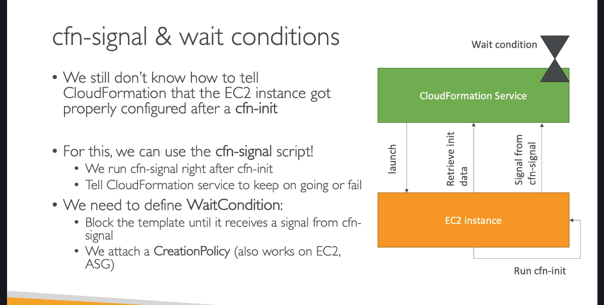
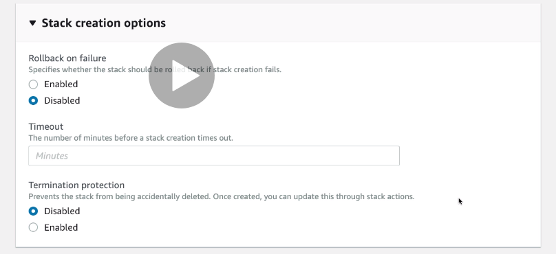
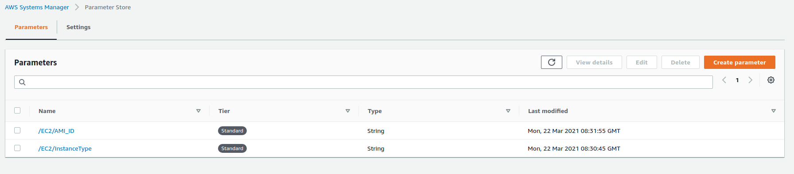
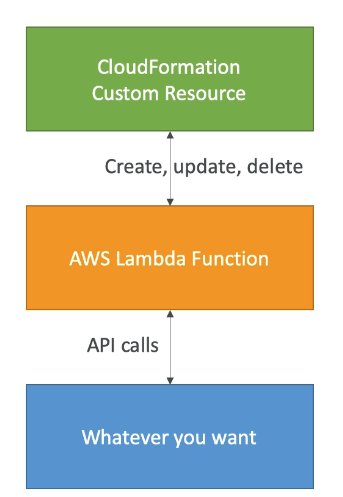
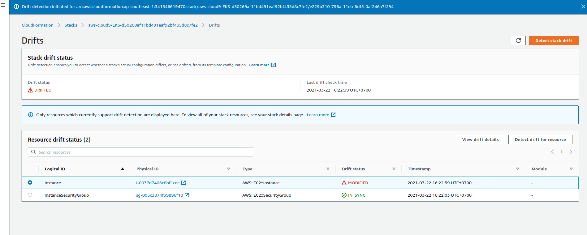

# CloudFormation  

## Pseduo Parameters

Pseduo parameters là parameters được định nghĩa trước bởi AWS như region, account id, ...

+ AWS::AccountId
+ AWS::Partition
+ AWS::Region
+ AWS::StackId
+ AWS::StackName
+ AWS::URLSuffix

## Conditions  

```yml
Conditions: 
    CreateProdResources: !Equals [ !Ref EnvType, prod ]
Resources:
    MountPoint: 
        Type: ...
        Condition: !ref CreateProdResources
```

Locical :  

+ Fn::And
+ Fn::Equals
+ Fn::Or
+ Fn::If
+ Fn::Not

## Intrisic Function  

+ Ref:  
  + Parameter: value
  + Resources: Physical id of resource
+ Fn::GetAtt: lấy giá trị của một resource

```yml
EC2Instance:
  Type: "AWS::EC2::Instance"
  ...
NewVolume:
  Properties:
    AvailabilityZone:
      !GetAtt: EC2Instance.AvailabilityZone
```

+ Fn::FindInMap : Lấy giá trị trong mapping : `!FindInMap [ MapName, TopLevelKey, SecondLevelKey ]`

```yml
!FindInMap [ RegionMap, !Ref "AWS::Region", 32 ]
```

+ Fn::ImportValue: import value từ các stack khác

`Stack A`

```yml
Outputs:
  PublicSubnet:
    Description: The subnet ID to use for public web servers
    Value:
      Ref: PublicSubnet
    Export:
      Name:
        'Fn::Sub': '${AWS::StackName}-SubnetID'
```

`Stack B`

```yml
SubnetId: !ImportValue 
  'Fn::Sub': '${NetworkStackNameParameter}-SubnetID'
```

+ Fn::Join : `!Join [ delimiter, [ comma-delimiter list of values ]]`

```yml
!Join [ ":", [ a, b, c ] ] -> 'a:b:c'
```

+ Fn::Sub : thay thế, giống như javascript cho phép chúng ta thêm biến vào string :  

```yml
Name:
  !Sub
    - "${var1Name}-${var2Name}"
    - { var1Name: value1, var2Name: value2 }
```

+ Condition Functions (Fn::If, Fn::Not, Fn::Equals, ...)

## EC2 Instance with cloudformation

`aws-cfn-bootstrap` là một tập các python scripts nhắm giúp cài đặt ứng dụng, khởi chạy dịch vụ trên các EC2 instance diễn ra dễ dàng hơn.  

+ `cfn-init`: cài đặt package, files, khởi chạy services  
+ `cfn-signal`: đưa ra các tín hiệu giúp đồng bộ với các tài nguyên khác, như khi EC2 đã cài đặt xong và sẵn sàng để làm việc.
+ `cfn-hup`: xem xét dựa trên các thay đổi của metadata trong khoảng thời gian mặc định là 15 phút, nếu có thay đổi thì chạy lại `cfn-init`.  

### UserData

`UserData` là các lệnh chạy khi khởi chạy  một Ec2 instance.  

```yml
MyEc2Instance:
  Type: "AWS::EC2::Instance"
  Properties:
    UserData: 
      Fn::Base64: |
        #!/bin/bash -xe
        yum update -y
        yum install -y httpd
        systemctl start httpd
        systemctl enable httpd
        echo "Hello World from user data" > /var/www/html/index.html
```

### cfn-init

Khi khởi chạy một Ec2 instance, `cfn-init` sẽ lấy các thông tin metadata từ cloudformation để chạy. Cung cấp một giao diện dễ nhìn hơn so với `UserData`.  

```yml

Resources:
  MyInstance:
    Type: AWS::EC2::Instance
    Properties:
      ...
      UserData: 
        Fn::Base64:
          !Sub |
            #!/bin/bash -xe
            # Get the latest CloudFormation package
            yum update -y aws-cfn-bootstrap
            # Start cfn-init
            /opt/aws/bin/cfn-init -s ${AWS::StackId} -r MyInstance --region ${AWS::Region} || error_exit 'Failed to run cfn-init'
    Metadata:
      Comment: Install a simple Apache HTTP page
      AWS::CloudFormation::Init:
        config:
          packages:
            yum:
              httpd: []
          files:
            "/var/www/html/index.html":
              content: |
                <h1>Hello World from EC2 instance!</h1>
                <p>This was created using cfn-init</p>
              mode: '000644'
          commands:
            hello:
              command: "echo 'hello world'"
          services:
            sysvinit:
              httpd:
                enabled: 'true'
                ensureRunning: 'true'
```

### Cfn-signal  

Để biết được script trong `cfn-init` thành công hay không, chúng ta cần dùng `cfn-signal`.  

  

Chạy lệnh `cfn-signal` ngay sau lệnh `cfn-init`:  

```bash
/opt/aws/bin/cfn-init -s ${AWS::StackId} -r MyInstance --region ${AWS::Region}
/opt/aws/bin/cfn-signal -e $? --stack ${AWS::StackId} --resource SampleWaitCondition --region ${AWS::Region}
```

Định nghĩa `WaitCondition`:  

```yml
SampleWaitCondition:
  CreationPolicy:
    ResourceSignal:
      Timeout: PT2M
      Count: 1
  Type: AWS::CloudFormation::WaitCondition
```

`cfn-signal` sẽ gửi kết quả trả về của lệnh `cfn-init` tới WaitCondition, từ đó sẽ thông báo tới Cloudformation Ec2 đã được chạy thành công hay không.  

Giả sử chúng ta cần debug xem lỗi gì mà `cfn-signal` lại không thành công, có thể xem xét tới các trường hợp sau:  

+ `aws-cfn-bootstrap` chưa được install
+ kiểm tra các log trong `/var/log/cloud-init.log` và `/var/log/cfn-init.log`
+ kiểm tra mạng của instance

Để tránh instance bị xóa khi có lỗi xảy ra, ta sẽ thiết lập cho stack không `rollback` bằng `donothing`:  



## Nested Stack  

Ta có thể sử dụng lại một stack đã có sẵn trong 1 stack khác. Khi delete stack cha sẽ delete cả stack con.

```yml
Resources:
  myStack:
    Type: AWS::CloudFormation::Stack
    Properties:
      TemplateURL: https://s3.amazonaws.com/cloudformation-templates-us-east-1/LAMP_Single_Instance.template
      Parameters:
        KeyName: !Ref SSHKey

Outputs:
  StackRef:
    Value: !Ref myStack
  OutputFromNestedStack:
    Value: !GetAtt myStack.Outputs.WebsiteURL
```

## DeletionPolicy  

Định nghĩa trạng thái của resource khi tiến hành delete stack :  

+ retain : giữ nguyên
+ delete : default, xóa
+ snapshot : tạo bản backup

```yml
MySG:
  Type: AWS::EC2::SecurityGroup
  DeletionPolicy: Retain
  Properties:
```

## SSM  

System Manager - quản lí các secret value.  
Thay vì nhập dữ liệu của người dùng, ta có thể lấy dữ liệu từ `SSM` dứoi dạng parameter store.  

```yml
Parameters:
  InstanceType:
    Type: 'AWS::SSM::Parameter::Value<String>'
    Default: /EC2/InstanceType

  ImageId: 
    Type: 'AWS::SSM::Parameter::Value<AWS::EC2::Image::Id>'
    Default: /EC2/AMI_ID
```

  

Từ đó, ta cũng có thể thay đổi các giá trị của các parameter store để update stack.  
Ngoài các secret parameter store do người dùng tạo, AWS cũng tạo một số public ssm để ta có thể dùng.  

```yml
Parameters:
  LatestLinuxAmiId:
    Type: 'AWS::SSM::Parameter::Value<AWS::EC2::Image::Id>'
    # obtain list with
    # aws ssm get-parameters-by-path --path /aws/service/ami-amazon-linux-latest  --query 'Parameters[].Name'
    Default: '/aws/service/ami-amazon-linux-latest/amzn2-ami-hvm-x86_64-gp2'
```

## DependsOn

Giống với `docker-compose`, Cloudformation cũng cho phép ta thiết lập tham số về thứ tự thực hiện các resource.  

```yaml
Resources:
  Ec2Instance:
    DependOns: MyDB
  MyDB:
```

`Ec2Instance` chỉ được tạo sau khi `MyDB` được tạo thành công. Điều này đảm bảo nếu Ec2Instance có thực hiện các kết nối tới database thì sẽ thành công.  

## Custom resource  

Ta có thể tạo các custom resource trong trường hợp các resource đó chưa được phát triển, trên các máy on-primes, hoặc cần thực hiện empty S3 bucket, ...  

  

Tạo một custom resource để empty S3 bucket bằng lambda function :  

```yml
myBucketResource:
  Type: AWS::S3::Bucket
LambdaUsedToCleanUp:
  Type: Custom::cleanupbucket
  Properties:
    ServiceToken: !ImportValue EmptyS3BucketLambda
    BucketName: !Ref myBucketResource
```

Event sẽ có dạng :  

```json
{
    "RequestType" : "Create",
    "ResponseURL" : "http://pre-signed-S3-url-for-response",
    "StackId" : "arn:aws:cloudformation:us-west-2:123456789012:stack/stack-name/guid",
    "RequestId" : "unique id for this create request",
    "ResourceType" : "Custom::TestResource",
    "LogicalResourceId" : "MyTestResource",
    "ResourceProperties" : {
       "Name" : "Value",
       "List" : [ "1", "2", "3" ]
    }
}
```

## Drift  

Khi ta chạy 1 cloudformation template, sau đó thay đổi bằng tay. Ta có thể dùng tính năng `drift detection` để phát hiện ra những thay đổi đó.  

  

## [Stack Policy](https://docs.aws.amazon.com/AWSCloudFormation/latest/UserGuide/protect-stack-resources.html)

Ta có thể định nghĩa stack policy để không cho phép việc sửa đổi lên một resource quan trọng.  

```json
{
  "Statement" : [
    {
      "Effect" : "Deny_or_Allow",
      "Action" : "update_actions",
      "Principal" : "*",
      "Resource" : "LogicalResourceId/resource_logical_ID",
      "Condition" : {
        "StringEquals_or_StringLike" : {
          "ResourceType" : [resource_type, ...]
        }
      }
    }  
  ]
}
```

Nhưng nếu thực sự cần, có thể sửa đổi stack policy tạm thời trong lúc update.  