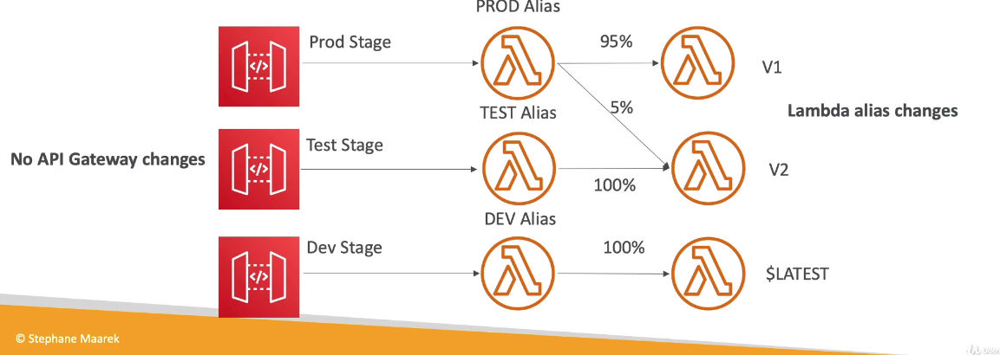
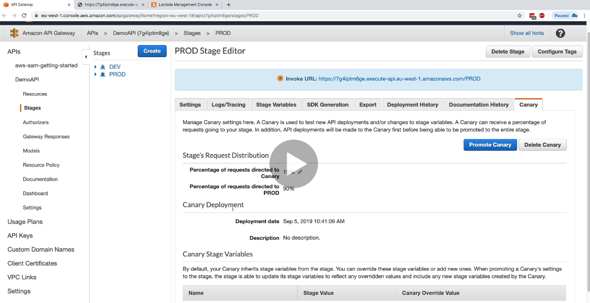
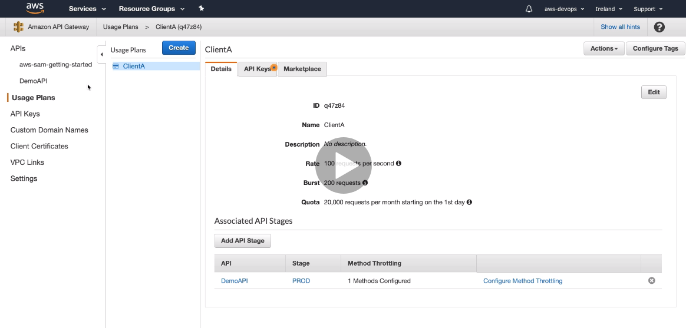

# API gateway  

## Integration with lambda  

Api gateway có thể trỏ tới một alias hoặc lambda version .  

Các thay đổi của api gateway chỉ có thể tác dụng khi thực hiện deploy lên các stage.  

  

+ canary deploy : cũng giống như blue/green deployement, khi mà ta muốn chuyển từ stage `dev` lên stage `prod` ta có thể dùng canary deploy để vẫn redirect một phần request tới `prod` endpoint sang `canary` - nơi chứa api gateway mới ta muốn deploy.  

  

Ta có thể hạn chế số lần truy cập vào api gateway bằng `user plan`:  

  

Mặc định là 10000 requests và 5000 burst.  

Ngoài ra, api gateway có thể giúp ta gọi tới các dịch vụ khác của aws như step functions, ...  
