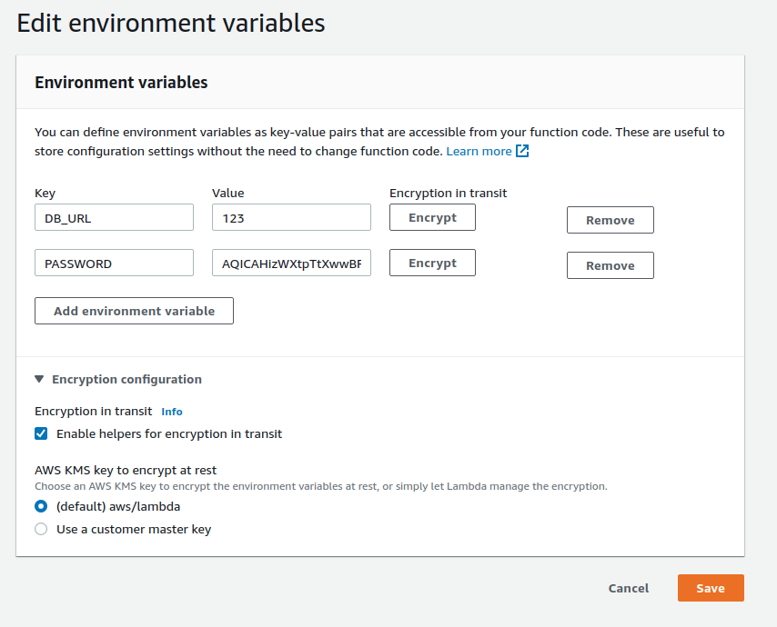
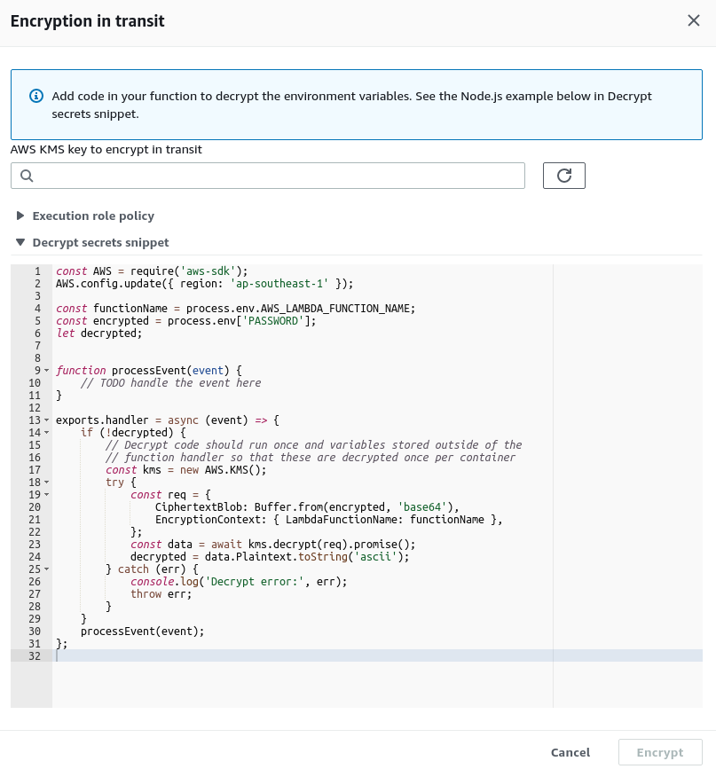
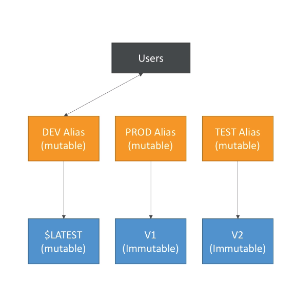
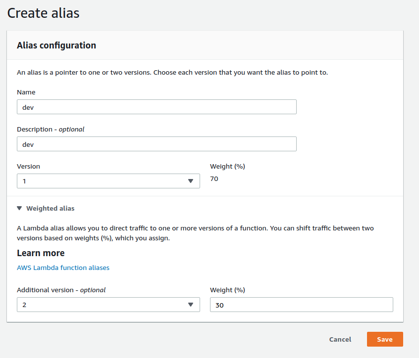

# Lambda  

## Security, enviroment variable  

  

Khi lưa chọn encrypt một variable, AWS cũng đưa ra luôn gợi ý về cách sử dụng biến sau khi đã bị mã hóa bằng SDK :  

  

Ngoài cách này ra, ta có thể sử dụng ssm hoặc Secret manager.  

## Version, alias  

Khi hoàn thiện một phiên bản, ta có thể deploy một lambda version. Lambda version không thể sửa đổi bất kì config nào (immutable).  

Alias là một con trỏ trỏ tới 1 lambda version. Ta có thể tạo 1 blue/green deployment khi cấu hình lưu lượng mạng tới từng version :  

  

  

## SAM  

Để debug lambda function local, ta có thể dùng sam framework.  

Tải [sam cli](https://github.com/aws/aws-sam-cli/releases/latest/download/aws-sam-cli-linux-x86_64.zip)  

Install :  

```bash
unzip aws-sam-cli-linux-x86_64.zip -d sam-installation
sudo ./sam-installation/install
sam --version
```

Các bước để tạo sam project :  

+ Khởi tạo project :  

```bash
sam init --runtime python3.7
```

Lưu ý version của python cần phải giống với phiên bản hiện tại đang có trên máy.

+ Build ứng dụng :  

```bash
sam build
```

+ Package ứng dụng :  

```bash
sam package --output packaged.yaml --s3-bucket bucketname --region ap-southeast-1 --profile default
```

+ Deploy application :  

```bash
sam deploy --template-file packaged.yaml --capabilities CAPABILITY_IAM --stack-name aws-sam --region ap-southeast-1 --profile default
```

### [Deploy serverless applications gradually](https://docs.aws.amazon.com/serverless-application-model/latest/developerguide/automating-updates-to-serverless-apps.html)  

Chúng ta có thể sử dụng sam cùng với `codedeploy` để cấu hình cách thức deploy :  

+ tự động tạo alias trỏ tới version mới
+ từ từ chuyển đổi request sang version mới
+ định nghĩa `pre-traffic` và `post-traffic` để kiểm tra functions hoạt động đúng như mong muốn.
+ Rollbacks khi Cloudwatch alarms bị kích hoạt

```yaml
AutoPublishAlias: live
DeploymentPreference:
    Type: Canary10Percent10Minutes 
    Alarms:
        # A list of alarms that you want to monitor
        - !Ref AliasErrorMetricGreaterThanZeroAlarm
        - !Ref LatestVersionErrorMetricGreaterThanZeroAlarm
    Hooks:
        # Validation Lambda functions that are run before & after traffic shifting
        PreTraffic: !Ref PreTrafficLambdaFunction
        PostTraffic: !Ref PostTrafficLambdaFunction
```
