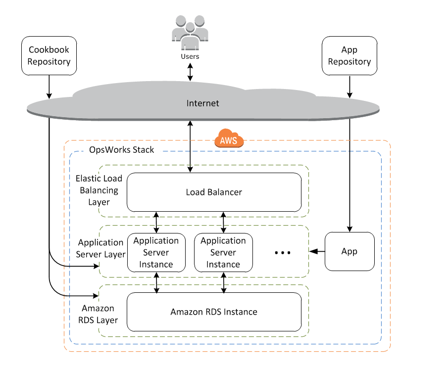
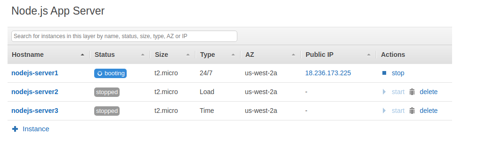
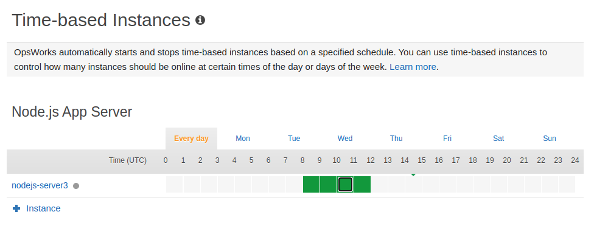
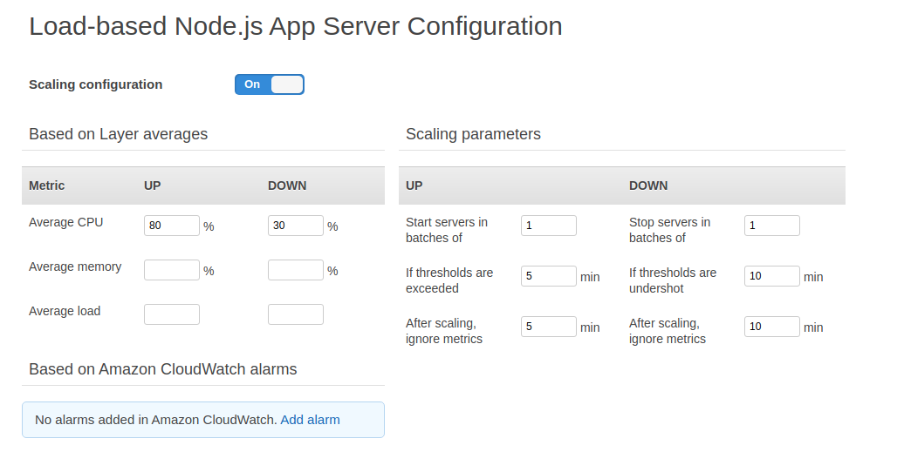
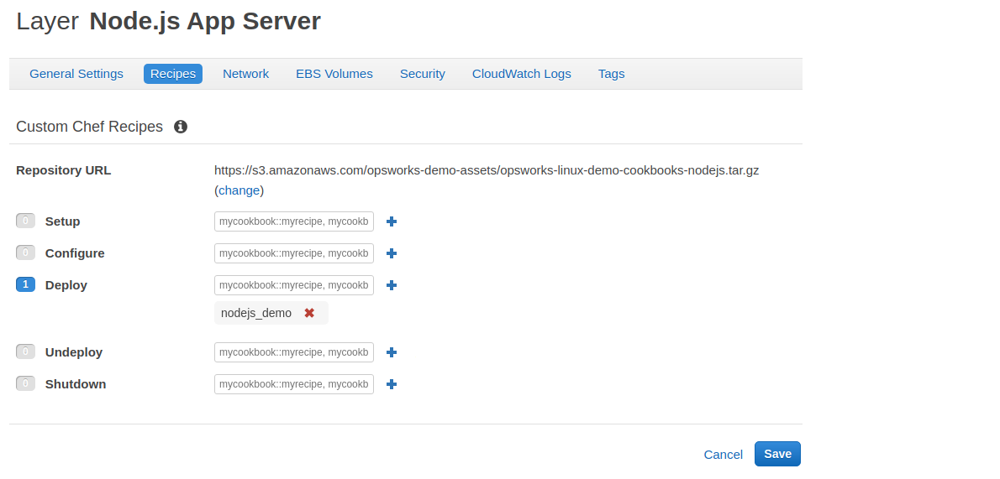

# Opsworks Stacks  

Để dễ dàng quản lí một nhóm các Ec2 instances, cũng như install các packages cần thiết để deploy server, quản lí phân quyền, hiệu năng, ...  

Một hệ thống được tạo bởi AWS Opsworks Stacks thường hômg một nhóm các servers chạy ứng dụng, đứng đằng sau một load balancer với backend là Amazon RDS database server.  

  

## Instances  

Có 3 loại instance :  

+ Normal : là instance chạy 24/7 có thể bật tắt bằng tay  

+ `Time-based` : ta có thể lập lịch chạy của instance  

  

+ `Load-based`: instance sẽ được chạy dựa trên tỉ lệ CPU, memory, load, ...  

  

## Lifecycle events  

Mỗi layer có tập hợp 5 lifecycle events có các recipes tương ứng. Khi một events xảy ra, Opsworks sẽ tự động chạy các recipes.  

  

+ Setup : chạy khi một instance làm xong đoạn booting.  
+ Configure : khởi chạy khi một instance bắt đầu hoặc rời khỏi trạng thái online. Gán Elastic IP cho một instance, gán một Load balancer. `Event này tiến hành xảy ra trên toàn bộ instance có trong layer`.  
+ Deploy : deploy ứng dụng lên các server instance
+ Undeploy : chạy lệnh undeploy để gỡ ứng dụng ra khỏi một instances.  
+ Shutdown : tắt một instance, đồng thời khi đó cũng dẫn tới event `COnfigure`.  

## Auto healing  

Mỗi instance có một agent gửi thông tin về với dịch vụ chính. Nếu trong một khoảng thời gian mà không có thông báo trả về thì Opsworks sẽ nhận định là instance failed.  
