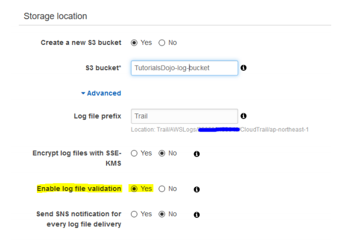
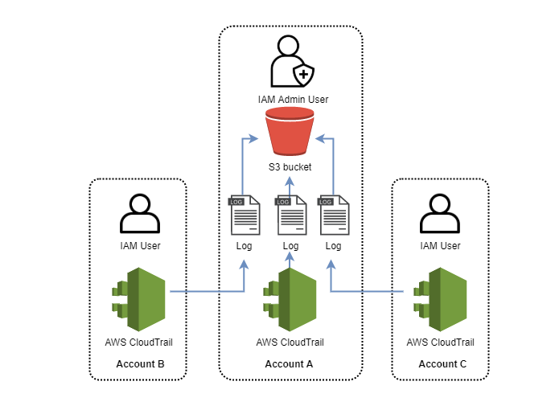
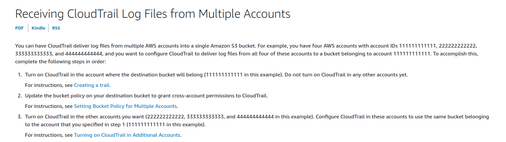

# CloudTrail  

Là một công cụ để quản lí tát cả các API call được diễn ra trong tài khoản AWS.  

  

Ta có thể theo dõi các API call xem đã làm những gì, cũng như quản lí các user. Các event log lưu lại các thông tin như là user, time, date, loại api, input parameters, response, ...  

## Log integrity  

Giả sử có hacker truy câp vào tài khoản AWS mà muốn xóa log trong trail thì sẽ bị phát hiện bởi tính toàn vẹn của log. CloudTrail sẽ lưu lại hash của từng file log. Nếu có sự chỉnh sửa hoặc xóa bỏ thì sẽ bị phát hiện nhờ vào hash.  

  

```bash
#!/bin/bash
aws cloudtrail validate-logs --start-time 2015-08-27T00:00:00Z --trail-arn arn:aws:cloudtrail:eu-west-1:903077646177:trail/DemoTrail --verbose --profile aws-devops --region eu-west-1
```

## Cross-account logging  

Nếu các account trong cùng 1 OU, ta có thể dùng tính năng cloudtrail của OU. Nhưng nếu không, ta có thể push tất cả log vào một S3 bucket tập trung tại server chính.  

  

  
