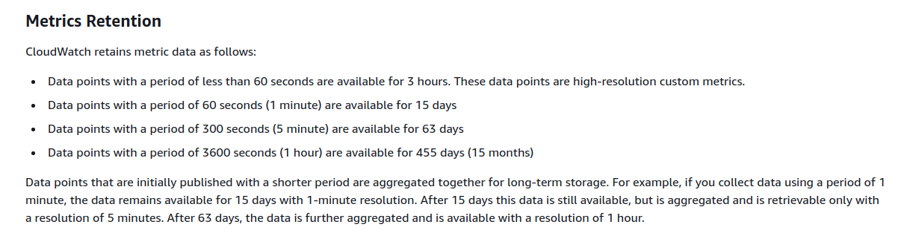
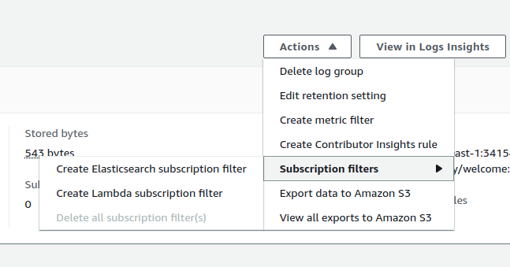
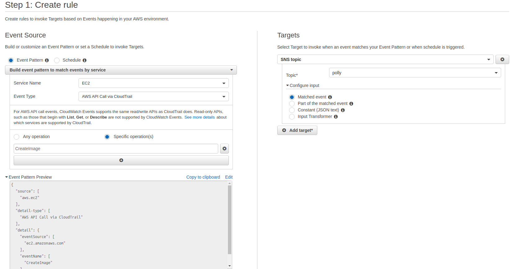
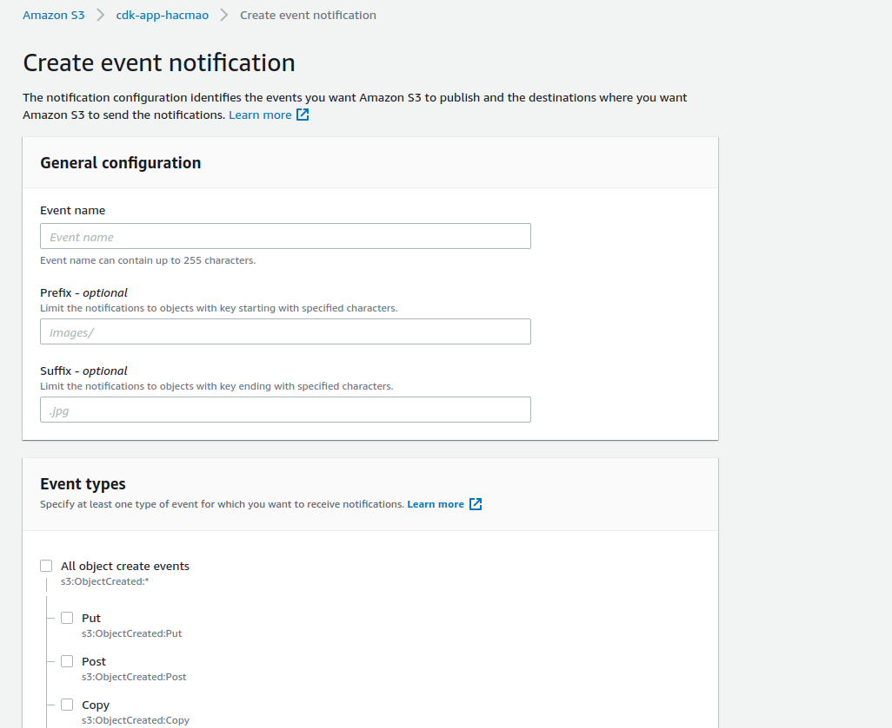

# Cloudwatch  

Một số khái niệm chủ yếu :  

+ Namespace : Tập các metric thuộc cùng 1 service
+ Metric : tên biến đang theo dõi
+ statistics : số liệu thống kê
+ dimensions : Tên đối tượng trong service  

Vd :  

```bash
aws cloudwatch get-metric-statistics --namespace AWS/EC2 --metric-name CPUUtilization \
--dimensions Name=InstanceId,Value=i-1234567890abcdef0 --statistics Maximum \
--start-time 2016-10-18T23:18:00 --end-time 2016-10-19T23:18:00 --period 360
```

## Metrics  

Metrics là tập các thống kê các thông số của các dịch vụ AWS.  

Metrics được quan sát theo hai định dạng : `basic` và `detail`. Khác nhau tai thời gian log metric dài hay ngẵn.  

  

## Metric filter  

Tại mỗi log group, ta có thể tạo các metric filter để lọc kết quả. Ví dụ như các request http có reponse code là 404. Ta có thể tạo metric đếm số lượng request tới như vậy. Đồng thời, từ đó tạo alarm để alert mỗi khi có quá nhiều request 404.  

## Alarm  

Ta có thể dùng alarm để theo dõi 1 metric (chỉ một metric) và thực hiện các action tương ứng khi đạt một ngưỡng nhất định.  

Hành động thông thường là gửi một SNS topic. Cũng có thể thực hiện Auto Scaling action.  
Riêng đối với các EC2 metric, ta còn có thể thực hiện các `Ec2 action` như bật, tắt, reboot instance.  

## Unified Cloudwatch Agent  

Ta có thể instanll cloudwatch agent để thiết lập gửi log từ một ec2 instance hoặc on-primse instance tới cloudwatch.  

Để cấu hình một Ec2Instance thì ta cần phải attach policy `AWSCloudWatchAgentAdminPolicy`.  

Cách cài đặt và khởi tạo config :  

```bash
#!/bin/bash
# install the agent
wget https://s3.amazonaws.com/amazoncloudwatch-agent/amazon_linux/amd64/latest/amazon-cloudwatch-agent.rpm 
sudo rpm -U ./amazon-cloudwatch-agent.rpm
# run the wizard
sudo /opt/aws/amazon-cloudwatch-agent/bin/amazon-cloudwatch-agent-config-wizard
```

Sau đó tới một loạt các cấu hình, có một số thứ ta có thể cấu hình tại đây như :  

+ monitor metrics  
+ cpu metrics
+ Ec2 dimensons
+ high resolution : tốc độ gửi metrics
+ Monitor log file : log của một số server như apache, httpd, ...
+ Lưu vào ssm

Sau khi config, file sẽ được lưu tại `/opt/aws/amazon-cloudwatch-agent/bin/config.json`, có output sau khi config xong.  

Tiếp đến là khởi chạy agent từ file cấu hình được lưu tại parameter store - ssm hoặc từ file local config.  

```bash
# options:
sudo /opt/aws/amazon-cloudwatch-agent/bin/amazon-cloudwatch-agent-ctl -a fetch-config -m ec2 -c ssm:AmazonCloudWatch-linux -s

sudo /opt/aws/amazon-cloudwatch-agent/bin/amazon-cloudwatch-agent-ctl -a fetch-config -m ec2 -c file:/opt/aws/amazon-cloudwatch-agent/bin/config.json -s
```

```bash
# create some missing files
sudo mkdir -p /usr/share/collectd
sudo touch /usr/share/collectd/types.db
```

## [subscription filter](https://docs.aws.amazon.com/AmazonCloudWatch/latest/logs/SubscriptionFilters.html)  



Ta có thể tạo subscription filter để truyền một luồng stream tới các target như lambda, kinesis stream, kinesis data firehose.  

Không thể tạo trực tiếp stream tới kinesis từ aws console mà phải dùng cli. Làm theo hướng dẫn bên trên.  

Dùng `put-subscription-filter`.  

## Cloudwatch integrate with cloudtrail  

  

Ta có thể thiết lập rule events cho từng service để theo dõi từng api call bằng cloudtrail. Khi có api call tương ứng sẽ trigger events.  

Ta có thể tìm kiếm các api call trên trang chủ của từng service, vd : [ec2](https://docs.aws.amazon.com/AWSEC2/latest/APIReference/API_Operations.html)  

Bằng cách tích hợp này, ta có thể làm nhiều thứ hơn như kích hoạt lambda khi tạo mới instance hay kích hoạt S3 khi có một object được put.  

## S3 events  

Ta có thể tạo trực tiếp event từ S3 để gọi lambda, SNS, SQS theo từng API call :  

  

Tuy nhiên nó không đầy đủ nên ta có thể dùng Cloudwatch events với `Object level operations` để theo dõi nhiều API call hơn.  
Tuy nhiên để điều này được hoạt động thì trước hết ta cần phải theo dõi S3 API call trong Cloudtrail đã.  
