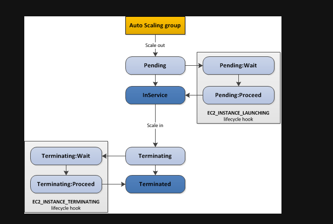

# Auto scaling group  

## Launch configuration vs Launch template  

Launch template cho phép ta có nhiều lựa chọn về cấu hình, có thể lưu lại để nâng cấp sau này, phân thành các version khác nhau.    
AWS khuyên dùng launch template.

tips : 
+ nếu muốn mix giữa spot và on-demand instance thì sẽ cần dùng launch template.  
+ Launch configuration không thể bị chỉnh sửa sau khi chạy. Muốn sửa đổi ta cần tạo một bản copy của configuration hiện tại, sau đó edit lại ASG để sử dụng bản launch configuration mới.  

## Scheduled Action  

Ta có thể cấu hình Autoscaling group thêm hoặc bớt instance tại thời điểm xác định. Ví dụ tại thời điểm thường lưu lượng truy cập vào web lớn.  

## Scaling policies  

Định nghĩa các mà Autoscaling group hoạt động.  

+ Instance cool down : khoảng thời gian giữa 2 lần thay đổi instance

Scaling policy quan trọng nhất là `metric`. Dựa trên metric ví dụ như CPU trung bình để xác định thời điểm scale out, scale in.  
Sau khi định nghĩa các sacling policy sẽ tạo ra 2 Cloudwatch alarm để theo dõi các instance, một cho scale out, 1 cho scale in.  

Ta có thể điều chỉnh số lượng instance tăng mỗi lần, tùy chỉnh nhiều metric để tăng số lượng theo mỗi mức metric. Ví dụ như CPU > 70 thì tăng 1, > 80 thì tăng 2, > 90 thì tăng 3.  

## Alb integration  

Slow start : thời gian mà một instance mới vừa kết nối với Target group. Instance sẽ nhận số request tăng dần.  

## Suspend Process  

Ta có thể tạm dừng một hành động, ví dụ như tăng, giảm instance, health check, ...  
Khi đó, dù có alarm trigger thì các hành động đó cũng bị dừng lại.  

+ `AddToLoadbalancer`: dừng thêm instance vào load balancer  

troubleshoot : Khi một instance có thể có vấn đề thì ta có thể `detach` instance ra khỏi mạng (sẽ tạo instance mới trong ASG) hoặc đặt vào `standby` mode (vẫn ở trong mạng ASG nhưng không còn trong load balancer).  

+ `Scale in protection` : ta có thể đưa một instance vào bảo vệ sẽ không bị tắt đi khi có scale in process.  

## Lifecycle hook  

  

Khi instance cần phải cài đặt những phần mềm tốn nhiều thời gian, ta sẽ đợi một khoảng thời gian trước khi thực hiện health check.  
Tương tự với termination, ta muốn lưu lại thông tin nào đó như log hoạt động vào S3.  

+ Notification : Với mỗi lần hooks, ta có thể nhận notification bằng cloudwatch event, SNS hoặc SQS topic.  

Khi mà các service hoàn thành công việc trước thời gian timeout, ta có thể trực tiếp hoàn thành nó.  

## Termination policy  

Định nghĩa khi scale in, instance nào sẽ bị terminate. Có nhiều option như `default`, `oldestInstance`, `NewestInstance`, .... 

`default` :  

+ Chọn instance trong AZ có nhiều instance nhất
+ Cố gắng thỏa mãn điều kiện ràng buộc giữa on-demand và spot instance
+ với ASG sử dụng launch template, terminate instance sử dụng oldest launch template
+ Chọn instance gần với giờ trả tiền tiếp theo nhất
