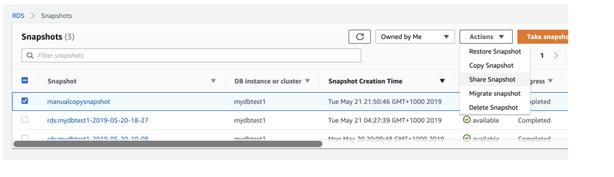
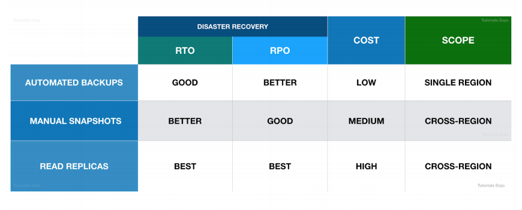
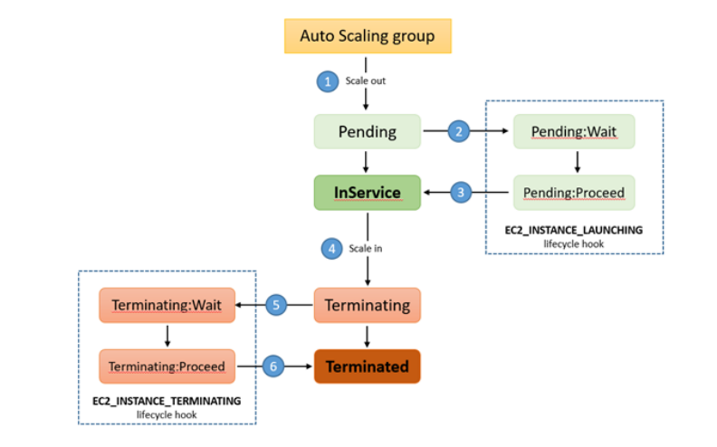

# High availability  

## Dynamodb  

+ Dynamodb stream sẽ được nhận bằng Lambda function. Max là 2 lambda function đọc 1 stream. Nếu không sẽ có thể bị throtling.   
+ Global dynamodb :  có thể add region cho table. Dynamodb sẽ tạo một read replica trong region khác. Dễ dàng quản lí, không phải cấu hình nhiều. Có thể viết được trên các region của dynamodb.  
+ TTL : ta có thể add ttl attribute để automatic remove item khỏi bảng.  
+ Dynamodb tự động sao lưu trên các AZ khác nhau trên cùng 1 region  

## Route53

### Routing policy  

+ Simple routing : có 1 domain
+ Failover routing : routing khi có lỗi xảy ra
+ geolocation routing : routing dựa trên location của người dùng
+ Latency routing : dùng khi có nhiều resource trên các region khác nhau, đưa request tới vùng có độ trễ thấp nhất
+ weighted routing : route theo tỉ lệ phần trăm người dùng thiết lập

## S3 

+ events
+ S3 replication : replication tới tài khoản khác, tới region khác
+ chuyển loại lưu trữ để tiết kiệm tiền
+ Với bucket version, sau khi delete object ta có thể recovery lại object  

## AMI  

+ AMI sẽ nhanh hơn UserData. Trong trường hợp cần thời gian nhanh nhất.  

## RDS  

+ Chia sẻ RDS tới tài khoản khác không thể chia sẻ trực tiếp snapshot mà cần phải tạo một bản copy của snap shot thì mới chia sẻ được.  

  

+ Trong các trường hợp update từ cloudforamtion mà yêu cầu replacement, thì rất có thể dữ liệu sẽ bị mất. Để đảm bảo dữ liệu không bị mất mát thì cần dừng tất cả ứng dụng truy cập database, tạo snapshot. `DBSnapshotIdentifier`.  

### Read replica  

Tạo ra một bản thay thế với dữ liệu được đồng bộ hóa theo kiểu `asynchronous` nhằm giảm tải lưu lượng tới bảng chính, có thể được đặt chung hoặc khác region.  

### Multi-AZ deployment  

Sử dụng synchronous replication, tạo các bản thay thế trên cùng 1 Region trên các AZ khác nhau.  

### Automated backup  

RDS có một tính năng tự động tạo bản backup và lưu vào trong S3. Tồn tại từ 0-35 ngày. Tạo ra một tính năng Disater recovery với giá trị thấp.  

## Auto scaling group  

### Lifecycle hooks  

  

