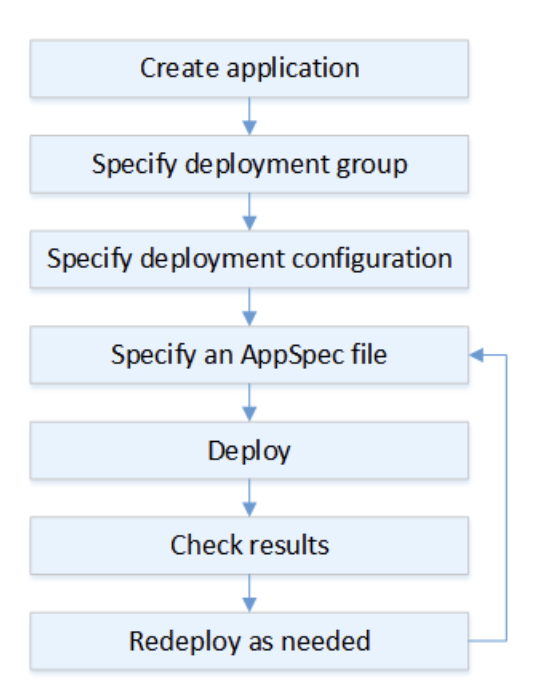

## This is tips note  

## AWS data pipeline  

Vận chuyển dữ liệu. Một bidata framework. ETL of things.  

## Cloudformation  

+ Netsted stack : stack tạo các stack khác dùng để sử dụng lại các stack đã có.

## STS  

Security Token service (STS) là một dịch vụ web cho phép cấp quyền tạm thời cho federated user.  

## Codedeploy  

## Continous integration  

+ Bao gồm cả tích hợp và build

## Elastic beanstalk  

+ để xử lí long running task, ta có thể dùng SQS
+ `leader_only` cho phép ta chạy lệnh trên một instance duy nhất
+ Lưu application version, khi có lỗi xảy ra có thể dễ dàng deploy lại version cũ.  

## EBS  

+ khi mới load ebs, cần có một khoảng thời gian để load dữ liệu nên thời gian này tốc độ đọc ghi sẽ bị chậm

## Opsworks  

+ Chef Recipe để cấu hình layer
+ Configure Lifecycle event sẽ chạy với tất cả instance có trong layer
+ Không nên dùng khi số lượng ít

